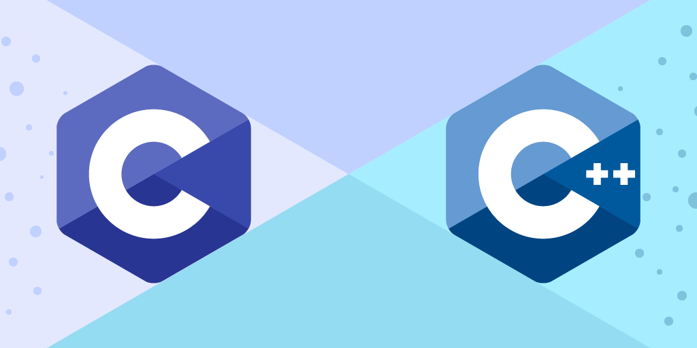

 

  

  <h3 align="center">Learn C and C++</h3>

  

    Basic to advance
     
     
    <a href="https://github.com/ajithr116/LEARN-C-and-CPP"><strong>Explore the docs »</strong></a>
     
     
    <a href="https://github.com/ajithr116/LEARN-C-and-CPP">View Demo</a>
    .
    <a href="https://github.com/ajithr116/LEARN-C-and-CPP/issues">Report Bug</a>
    .
    <a href="https://github.com/ajithr116/LEARN-C-and-CPP/issues">Request Feature</a>
  

      

## Table Of Contents

* [About the Project](#about-the-project)
* [Built With](#built-with)
* [Getting Started](#getting-started)
  * [Prerequisites](#prerequisites)
  * [Installation](#installation)
* [Usage](#usage)
* [Roadmap](#roadmap)
* [Contributing](#contributing)
* [Authors](#authors)
* [Acknowledgements](#acknowledgements)

## About The Project

Welcome to the "Learn C and C++" repository! This repository documents my journey of learning C and C++, from the basics to more advanced concepts. I aim to improve my programming skills, explore low-level programming, and develop efficient and performant code.

Throughout this learning journey, I plan to cover a wide range of topics, including data structures, algorithms, memory management, file handling, and more. By diving deep into C and C++, I hope to gain a solid understanding of how these languages work and how they can be leveraged to build powerful and robust applications.

In addition to exploring the core concepts, I will be working on exciting projects that put theory into practice. These projects will not only reinforce my learning but also serve as valuable portfolio pieces to showcase my coding skills to potential employers and the developer community.

I am open to collaboration and feedback from the community. If you come across any errors in my code or have suggestions to improve the learning material, please don't hesitate to reach out. Let's learn together and make this repository a valuable resource for aspiring C and C++ programmers!

Join me on this adventure as I delve into the world of C and C++. Together, we will unravel the mysteries of these powerful languages and unlock the true potential of our programming abilities. Happy coding!

<h4>Daily Progress</h4>
    <h5>Day 1 - 28-07-2023</h5>
    <ul>
        <li>Learned about variables, data types, and basic I/O in C.</li>
        <li>Wrote a "Hello, World!" program in C.</li>
        <li>Explored the fundamentals of C++ and its differences from C.</li>
<li>Learned If else and switch</li>
    </ul>

    

## Built With

Pure C and C++

## Getting Started

For C: Install a C compiler such as GCC (GNU Compiler Collection).
For C++: Install a C++ compiler such as g++ (GNU C++ Compiler) or Visual C++ (for Windows).

### Prerequisites

Before you dive into learning C and C++, ensure that you have the following prerequisites installed on your system:

A code editor or Integrated Development Environment (IDE) like Visual Studio Code, Sublime Text, or Code::Blocks.
Git: Version control system to clone and manage the repository.
A working knowledge of basic programming concepts would be beneficial, but not mandatory.

### Installation

Follow these steps to set up your development environment and run the code examples:

<b>Install a C and C++ Compiler: </b>Refer to the official documentation for your operating system to install the appropriate compiler.

GCC (GNU Compiler Collection) is commonly used for C and C++ on various platforms.
Code Editor or IDE: Install a code editor or IDE of your choice. Choose one that best suits your preferences and operating system.

<b>Clone the Repository:</b> Use the git clone command mentioned in the "Getting Started" section to clone the repository to your local machine.

<b>Explore the Examples:</b> Navigate to the C/ and Cpp/ directories to find the code examples for each day of learning. Open the files in your code editor or IDE to explore and run the code.

Let's embark on this learning journey together and discover the exciting world of C and C++. Happy coding!

<code>
In this example, the "Getting Started" section provides instructions on how to clone the repository and set up a development environment. The "Prerequisites" section outlines the requirements to follow the code examples, while the "Installation" section explains the steps to install a C and C++ compiler and set up your code editor or IDE. These sections will help users understand how to get started with your repository and start learning C and C++.
</code>

## Usage

To run the code examples and projects in this repository, follow these steps:

    <ol>
        <li>Navigate to the specific directory containing the code you want to run, such as `C/` or `Cpp/`.</li>
        <li>Open the desired code file in your preferred code editor or IDE.</li>
        <li>Compile the C or C++ code using your installed compiler. For example, if you have GCC installed, use the following commands in the terminal or command prompt:</li>
    </ol>
    <pre><code>gcc -o output_file_name source_file_name.c</code></pre>
    <pre><code>g++ -o output_file_name source_file_name.cpp</code></pre>
    
Replace `output_file_name` with a desired name for the output file and `source_file_name.c` or `source_file_name.cpp` with the name of the code file you want to compile.

    
After successful compilation, you can run the executable by executing the following command:

    <pre><code>./output_file_name</code></pre>
    
For Windows users, the command to run the executable may differ.

    
Feel free to modify and experiment with the code examples to deepen your understanding of C and C++. Have fun learning!

## Roadmap

### Step 1: Introduction to Programming Concepts

1. Basics of Programming: Get familiar with general programming concepts like variables, data types, operators, and control structures.

### Step 2: C Programming Fundamentals

2. Introduction to C: Learn about the history and features of the C language.
3. C Syntax and Structure: Understand the syntax and structure of C programs.
4. Input and Output: Learn how to read input and display output using C's standard I/O functions.
5. Control Statements: Explore conditional statements (if-else) and looping constructs (while, for) in C.

### Step 3: C++ Basics and Object-Oriented Programming (OOP)

6. Introduction to C++: Understand the fundamentals of C++ and its differences from C.
7. C++ Classes and Objects: Learn about classes, objects, and member functions in C++.
8. Constructors and Destructors: Explore constructors and destructors in C++ classes.
9. Inheritance: Understand inheritance and its role in object-oriented programming.
10. Polymorphism: Study polymorphism, including function overloading and virtual functions.

### Step 4: C and C++ Intermediate Concepts

11. Pointers and Memory Management: Learn about pointers and dynamic memory allocation in C and C++.
12. File Handling: Understand how to read and write files in C and C++.
13. Data Structures: Explore basic data structures like arrays, linked lists, and stacks in C and C++.

### Step 5: Advanced C++ Concepts

14. Templates: Study C++ templates for generic programming.
15. Standard Template Library (STL): Learn about the STL and its containers, algorithms, and iterators.

### Step 6: Advanced C Programming

16. Advanced C Features: Dive into advanced C concepts like function pointers and preprocessor directives.

### Step 7: Real-World Projects

17. Work on C and C++ projects: Apply your knowledge to build practical applications and projects.

### Step 8: Performance Optimization and Debugging

18. Optimizing C and C++ Code: Explore techniques to improve performance in C and C++ programs.
19. Debugging: Learn debugging tools and strategies to identify and fix issues in your code.

### Step 9: Additional Topics

20. Multithreading and Concurrency: Study multithreading and concurrent programming concepts in C and C++.

## Resources

Here are some recommended resources to help you along your learning journey:

- [C Programming - The C Programming Language](https://www.learn-c.org/)
- [C++ Tutorial - Learn C++](https://www.learncpp.com/)
- [C++ Standard Library Reference](https://en.cppreference.com/w/)

Remember, learning programming is a continuous journey, and practice is key to mastering C and C++. Work on small projects, contribute to open-source projects, and engage with the programming community to reinforce your skills and stay motivated. Happy coding!

## Contributing

Welcome to the "Learn C and C++" project! We appreciate your interest in contributing to this repository and helping learners in their journey to master C and C++ programming. Contributions of all kinds, whether big or small, are highly valuable.

<h3>How to Contribute</h3>

To contribute to this project, follow these steps:

<ol>
    <li><strong>Fork the Repository:</strong> Click on the "Fork" button at the top right corner of this repository's page to create a copy of the repository in your GitHub account.</li>
    <li><strong>Clone the Repository:</strong> On your local machine, use the <code>git clone</code> command to clone the forked repository:</li>
</ol>

<pre><code>git clone https://github.com/your-username/Learn-C-and-Cpp.git</code></pre>

<ol start="3">
    <li><strong>Create a New Branch:</strong> Create a new branch with a descriptive name for your contribution:</li>
</ol>

<pre><code>git checkout -b new-feature</code></pre>

<ol start="4">
    <li><strong>Make Changes:</strong> Add your code examples, fix issues, or make improvements to the existing content.</li>
    <li><strong>Commit Changes:</strong> Commit your changes with a clear and concise commit message:</li>
</ol>

<pre><code>git commit -m "Add new C++ example: Fibonacci sequence"</code></pre>

<ol start="6">
    <li><strong>Push to Your Fork:</strong> Push the changes to your forked repository:</li>
</ol>

<pre><code>git push origin new-feature</code></pre>

<ol start="7">
    <li><strong>Open a Pull Request:</strong> Go to the original repository on GitHub (<a href="https://github.com/ajithr116/Learn-C-and-Cpp">https://github.com/ajithr116/Learn-C-and-Cpp</a>) and click on the "New Pull Request" button. Select your branch and describe your contribution in the pull request.</li>
    <li><strong>Wait for Review:</strong> Your pull request will be reviewed by the maintainers, and any feedback or suggestions will be provided.</li>
    <li><strong>Merge:</strong> Once your contribution is approved, it will be merged into the main repository. Congratulations, you've successfully contributed!</li>
</ol>

<h3>Contribution Guidelines</h3>
<ul>
    <li>Please ensure that your code examples, explanations, and contributions are relevant to C and C++ learning.</li>
    <li>Follow consistent coding styles and formatting used in the repository.</li>
    <li>Keep the examples and explanations concise and easy to understand for learners of all levels.</li>
    <li>Test your code examples to make sure they work as expected.</li>
    <li>If you're suggesting a new topic or adding a new section, provide a brief explanation of the content's relevance and significance.</li>
    <li>Respect the existing contributors and maintain a positive and collaborative environment.</li>
</ul>

Thank you for contributing to the "Learn C and C++" project and helping others on their learning journey! Your efforts will make a difference in the programming community.

### Creating A Pull Request

If you have made changes or improvements to the "Learn C and C++" project and would like to contribute them, you can do so by opening a pull request.

1. Click on the "Pull Request" tab at the top of the repository.
2. Click the green "New Pull Request" button.
3. Select the branch with your changes.
4. Provide a clear title and description for your pull request.
5. Click the "Create Pull Request" button.

Our team will review your pull request, provide feedback if needed, and merge it into the main repository if everything looks good.

Thank you for your interest in contributing to "Learn C and C++"!

## Authors

* **Ajith R** - *Degree student* - [Ajith R](https://github.com/ajithr116/) - *Built ReadME Template*

## Acknowledgements

* [ShaanCoding](https://github.com/ShaanCoding/)
* [Othneil Drew](https://github.com/othneildrew/Best-README-Template)
* [ImgShields](https://shields.io/)
